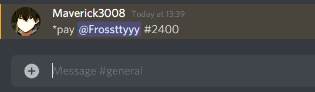

# Dispay bot

A simple discord bot that automates the process of p2p payment using Razorpay APIs. Dispay is the only bot you need to automate your payments in your discord community.

## Checkout our website to learn more!
[www.dispay.com](https://dispay.netlify.app/)


## Getting started

First, make sure you have all the required tools installed on your local machine then continue with these steps.

### Installation

```bash
# Clone the repository
git clone https://github.com/anomic30/Dispay-bot.git
# Enter into the directory
cd dispay-bot/
# Install the dependencies
npm install
```

### Starting the application

```bash
# To start the Dispay-bot which will run at port 3001
node index.js
```
```bash
# To start the local JSON server which will run at port 3000
json-server --watch payoutResponse.json
```

## Features & Commands

* 💸 Pay a discord user 

`*pay @payee_name #amount`

<br />


## Contributing

You are welcome to contribute by submitting a Pull Request to the repository.

## Author

[Anom Chakravorty](https://github.com/anomic30)
<br/>
[Aditya Mondal](https://github.com/Sneakad)
<br/>
[Tuhin Paul]()
